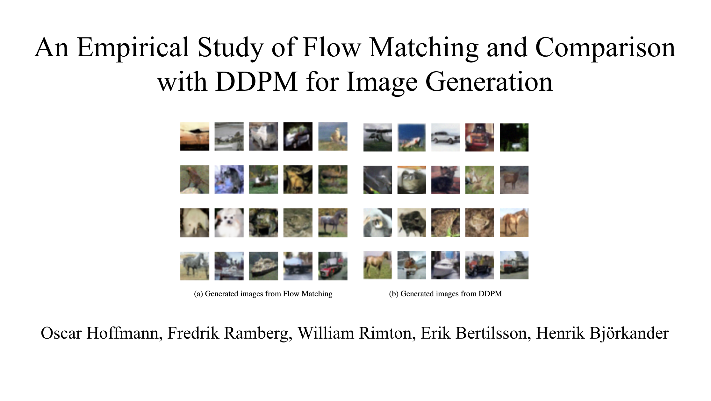
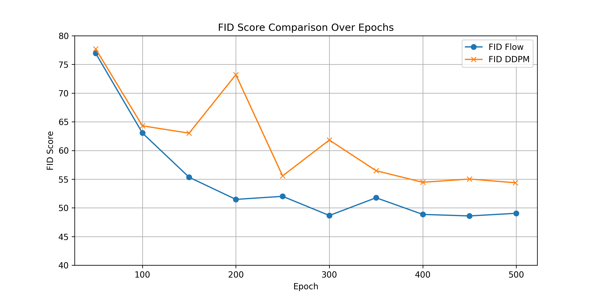

# Flow Matching with Optimal Transport vs. DDPM on CIFAR‑10

  

This repository presents a full implementation and comparison of two generative models evaluated using the Fréchet Inception Distance (FID) onthe CIFAR‑10 dataset:

- **Flow Matching with Optimal Transport (FlowOT)**  
  leverages optimal transport theory to define straight‑line probability paths and trains a continuous normalizing flow in a simulation‑free manner, dramatically reducing the need for costly ODE solves during training

- **Denoising Diffusion Probabilistic Model (DDPM)**  
  A classic 1,000‑step diffusion process with a U‑Net backbone and MSE loss.
- **Metrics**  

  FID score, sample quality grids, and inference time benchmarks.

Both are trained for 500 epochs on **50 000 train / 10 000 test** CIFAR‑10 images, using only a **consumer‑grade GPU** (NVIDIA 4060 Ti 16 GB VRAM). Under identical compute budgets, FlowOT achieves **FID ≈ 49** vs. DDPM’s **≈ 55**, while sampling ∼ 20 % faster. 

This repository provides training, eval and visualization scripts. Results can easily be reproduced using the respective model checkpoints. 

---

## Experimental Setup

- **Architecture**: U‑Net backbone for both FlowOT & DDPM  
- **DDPM β‑schedule**: linear from 0.0001 to 0.02 over 1 000 steps, MSE loss  
- **Hardware**: NVIDIA RTX 4060 Ti (16 GB), 32 GB RAM, Intel i7‑8700K  
- **Dataset**: CIFAR‑10 (32×32 RGB)  
  - 50 000 training images  
  - 10 000 test images  
- **Training**: 500 epochs, batch size 128, Adam (β₁ = 0.9, β₂ = 0.999, ϵ = 1e‑8), polynomial LR decay

---

## Results

  

FlowOT: **~49 FID** (vs. DDPM’s ~55); inference time: **~800 ms/image** vs. **~1 000 ms/image**.

Please see "Paper.pdf" for full details. 

## Repository Structure
    .
    ├── DDPM/                # Implementation of denoising diffusion probabilistic models
    ├── FlowOT/              # Implementation of flow matching with optimal transport
    ├── helpers/             # Helper scripts and utilities
    ├── Paper.pdf            # The research paper for the project
    ├── requirements.txt     # Python dependencies

## Getting Started

Install dependencies:

    pip install -r requirements.txt

Training and evaluation scripts/notebooks are available in respective folders. Checkpoints and training logs can be found in subdirectories of FlowOT and DDPM. Checkpoints are stored with Git LFS.

## Acknowledgements
This project project was created together with my peers mentioned in the paper